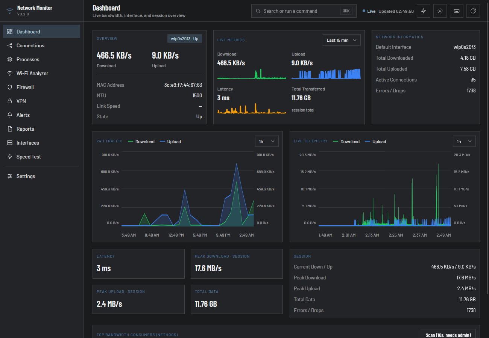
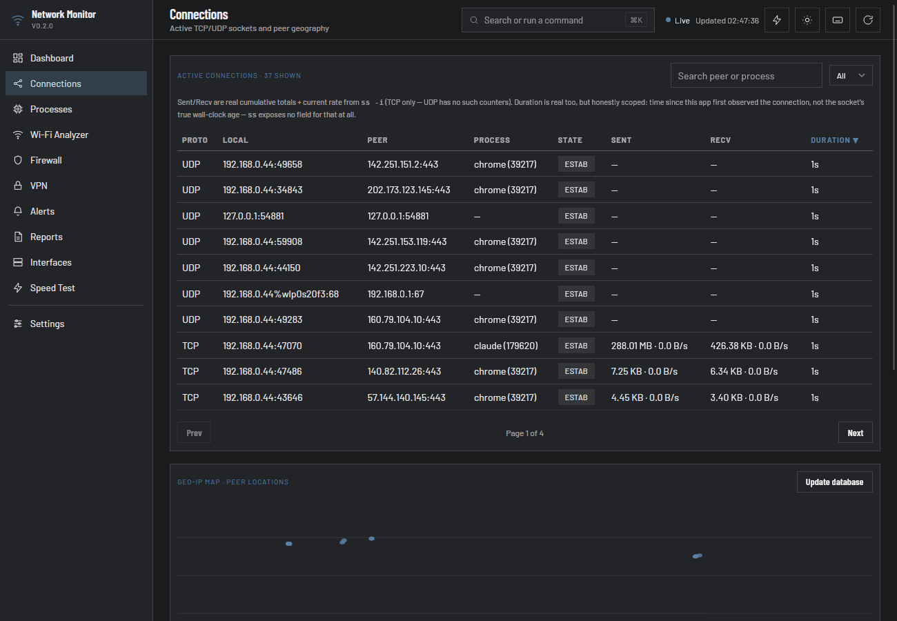
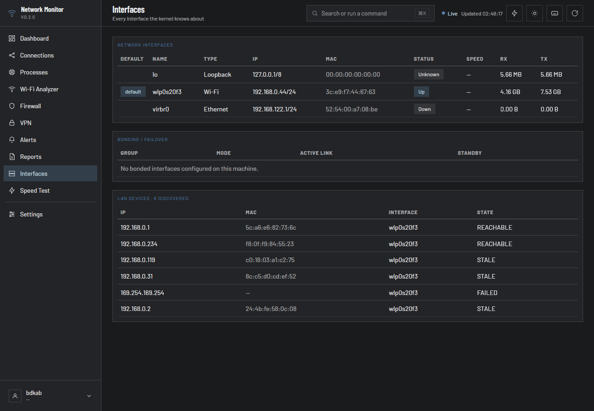

# Network Monitor

[](https://github.com/bdkabiruddin/network-monitor/actions/workflows/ci.yml)
[](LICENSE)

A native, real-time network dashboard for Linux desktops. Bandwidth,
connections, Wi-Fi, firewall, VPN, and long-term traffic history — all
backed by real system data, with nothing simulated or faked.



<details>
<summary>More screenshots — Connections (Geo-IP map) &amp; Interfaces</summary>




</details>

## Why

Most of this information is already on your system somewhere —
`/proc/net/dev`, `ss`, `nmcli`, `nft` — but scattered across a dozen CLI
tools with no history, no charts, and no single place to look. Network
Monitor pulls it into one native window: live numbers where a live
number is possible, a clear "not available" where it isn't, and nothing
in between.

## Features

**Live Dashboard** — real-time download/upload rate, latency, MAC/MTU/
link speed/state for your default interface, session peaks, active
connection and error/drop counts, plus two live charts (24h traffic and
a shorter-window telemetry view) with hover tooltips and a range
selector.

**Connections** — every active TCP/UDP socket, with real per-connection
sent/received byte counts and live throughput (not estimated), sortable
and paginated. Includes a Geo-IP map of remote peers — city, country,
and network registrant (ASN/organization) — using a downloadable local
database, no third-party lookup service involved.

**Processes** — which processes are actually driving your network
traffic, ranked by open connections, with an optional deeper scan
(`nethogs`) for real per-process bandwidth.

**Wi-Fi Analyzer** — your connected network's details plus every nearby
access point NetworkManager can see: signal strength, channel, band,
security.

**Interfaces** — every interface the kernel knows about (not just the
active one), bonding/failover group status, and the devices currently
visible on your LAN.

**VPN** — NetworkManager VPN profiles with one-click connect/disconnect.

**Firewall** — a read-only view of your live nftables ruleset, grouped
by table and chain. Deliberately read-only: a monitoring tool shouldn't
be the thing that locks you out of your own network.

**Speed Test, Ping, Traceroute, Packet Capture, Port Scan** — the tools
you'd normally reach for a terminal for, in the same window as
everything else.

**Alerts** — a baseline-aware anomaly detector flags real traffic spikes,
with optional desktop notifications.

**Reports & History** — CSV export of recorded history for any period,
a configurable retention window with automatic pruning, and a monthly
data usage tracker you can set a cap against.

**Runs quietly in the background** — closes to a system tray icon with
a live bandwidth label, single-instance enforced so it never
accidentally doubles up.

No telemetry, no accounts, no cloud dependency. Everything lives in a
local SQLite database on your own machine.

See **[`ROADMAP.md`](ROADMAP.md)** for the full per-screen feature
breakdown and known gaps.

## Installing

Prebuilt packages: see [Releases](https://github.com/bdkabiruddin/network-monitor/releases)
for a `.deb` or `.AppImage`.

## Building from source

```sh
git clone https://github.com/bdkabiruddin/network-monitor
cd network-monitor

# Needs the Tauri Linux prerequisites: webkit2gtk-4.1-dev,
# libayatana-appindicator3-dev, librsvg2-dev, build-essential, libssl-dev
cd app && cargo run
```

## How it works

- **[`core/`](core)** (`netmon-core`) — a data-layer library with no UI
  code of its own, reading directly from `/proc/net/dev`,
  `/sys/class/net/*`, `ip route`, `ping`, `ss -tuinp`, `nmcli`, and
  (behind a `pkexec` prompt) `nethogs`/`nft`/`tcpdump`, plus a SQLite
  history store.
- **[`app/`](app)** — the Tauri 2 backend: a background thread polls
  bandwidth and connections every 2 seconds, everything else is
  fetched on demand as you navigate.
- **[`frontend/`](frontend)** — plain HTML/CSS/JS, no framework, no
  build step.

Nothing in the app fabricates data — a feature either shows a real
reading or an honest "—" / "not implemented" placeholder.

## Project structure

```
core/                  netmon-core: the data layer (no UI)
app/                   Tauri 2 Rust backend
frontend/              HTML/CSS/JS frontend (no build step)
.github/               CI workflow, issue/PR templates
SECURITY.md            Vulnerability reporting, privilege/network scope
```

## Support

If this is useful to you, consider [sponsoring on GitHub](https://github.com/sponsors/bdkabiruddin).

## License

[MIT](LICENSE)
